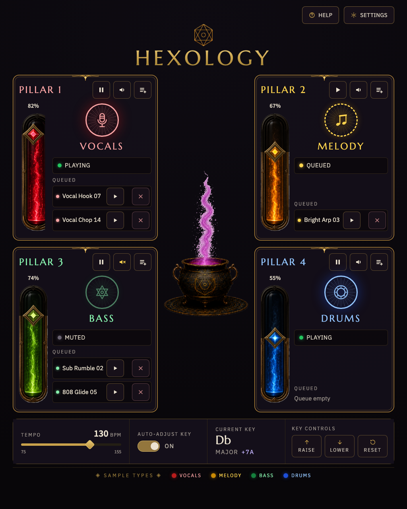

# WOW-007A — Play-mode visual-fidelity spike — implementation note

Role: frontend-implementer (with human visual direction in-session)
Date: 2026-07-16 → 2026-07-17
Branch: `feat/wow-007a-play-mode-visual-spike`

## What was built

A browser-rendered, static/mock-data **play-mode** screen at the canonical
**1024 × 1280 portrait** viewport, demonstrating the approved visual direction
(`docs/design/hexology-grimoire-concept-3.png`). The render was iterated with
the human through **seven visual-checkpoint rounds** and approved at round 7
(2026-07-17).

### Screen contents

- **Wordmark**: HEXOLOGY in Marcellus with a gilt gradient, the bespoke gold
  hexagram **logo symbol asset** above it (single `<h1>`).
- **Four symmetrical pillar cards** (one shared `PillarCard`; only category +
  state differ): amber double-border frame with top-centre flourish (corner
  embellishments removed per human direction), header row with pillar name +
  **play/pause, mute, sample-selector icon buttons** (≥ 44 px), a full-height
  **potion-tube volume indicator** built from the supplied tube + gem assets
  (dimmed art as empty glass, clipped art as lit fill, gem riding the fill
  line), category **medallion** with inner ray-burst + icon
  (mic / musical notes / hexagram / drum — interim SVG glyphs), **current
  status** row, and up to **two queued-sample rows** (name + play + remove,
  44 px touch targets, remove red-tinted and separated per mis-tap concern).
- **Central cauldron**: the supplied cauldron asset with its magenta plume.
- **Settings band**: tempo (value + slider + range), auto-adjust-key toggle,
  current key + difference, Raise/Lower/Reset key controls.
- **Legend**: the four sample types, colour + name.
- **Visible Help + Settings** affordances (not yet wired to a modal).

### Design-token / infrastructure changes

- `tailwind.config.cjs`: gold/ink/parchment colour tokens, `font-display`
  (Marcellus) / `font-data` (IBM Plex Sans) / `font-number` (Source Sans 3)
  families, grimoire page gradient, calm `pulse-calm` keyframe (≥ 1 s, §7.4).
- `src/index.css`: `@font-face` for the three vendored OFL families
  (`public/fonts/`, latin subset — see `public/fonts/README.md` for licences).
- `src/util/ColorUtil.ts`: Melody warmed `bg-yellow-700` → `bg-yellow-600`
  (human, 2026-07-15). **Single source of truth preserved.**
- `src/util/CategoryTheme.ts`: presentation tokens per category (label, AA
  `-300` text tints, resolved hex for SVG/glow use, asset slug); fill class
  still sourced from `ColorUtil`.
- `src/main.tsx`: temporary `#play-spike` hash demo switch. **Not a routing
  feature and not a production cutover** — the default entry is unchanged and
  the spike renders outside the socket/Ableton providers (no live connection).

### Asset provenance & processing

Human-supplied pack `hexology-ui-assets` (2026-07-16): logo symbol, cauldron,
four slider tubes, four gem handles. Processing (PIL, documented here for
reproducibility): tubes isolated from sheet crops by opaque-column
segmentation (picking the saturated segment); remaining baked checkerboard in
**enclosed** regions of the logo/cauldron keyed out (low-saturation + light
pixels); all trimmed and downscaled (~1.9 MB total).

**Update 2026-07-17 (`hexology-ui-assets-fixed`):** the human re-exported the
slider set with the cropping fixed — clean single tubes, uniform dimensions,
real alpha (plain trim + resize, no segmentation/keying needed). The complete
`slider-background-empty.png` now renders empty pillars directly, replacing
the earlier CSS-desaturated fallback. Slider files only — the cauldron in
that folder is still being iterated by the human and was deliberately **not**
copied.

## Post-gate visual iteration round 2 (2026-07-17, human-directed)

After the pipeline gate, a second in-session iteration round with the human
reshaped the card and centre composition (all still static/mock, frontend-only):

- **Category-coloured pillar frames** (+ discrete tinted gradient wash);
  pillar names removed — the playing sample's category heads each card with
  its status line; empty state restyled (— EMPTY — / AWAITING INGREDIENT,
  `+` medallion).
- **Colour token refinements** at the single source: `melody-yellow`
  (`#dfa50a`) and desaturated `drums-blue` (`#3559c0`) — both flagged for
  physical-LED re-verification.
- **Layout**: cards stretch to fill the viewport height (taller tubes);
  medallions +50% with equalizer bars beneath; volume readout moved below the
  tube; logo raised + wordmark 30% smaller; queue rows: play left / remove
  far right; **oversized cauldron** (405px) deliberately extends behind the
  cards (out-of-flow over a 180px spacer column, cards layered above).
- **Cauldron art**: `hex-cauldron-black-bg-2.png`, edge-feathered onto a
  thick black radial glow (blends into any page ground).
- **Interactivity + animation system** (all compositor-only
  transform/opacity, `motion-safe`-gated): equalizer bars dance while a
  sample plays (static when muted/paused, absent when empty); magic-cauldron
  ambience — 5 desynced rising blobs, ±4px vessel float, one-shot expanding
  click ring (centering baked into keyframes: an animated transform replaces
  utility translates); **Settings modal** (Headless UI Dialog) with a global
  **Animations kill-switch** that disables every animation on the fly
  (kiosk-performance escape hatch) — verified live: blobs/float/ring/eq all
  zero when off.

Validation after the round: lint clean, 233 tests, build green, exact
1024×1280 fit, ring centering measured at 0px delta.

Round-2 review follow-ups applied (reviewer + ui-designer + Copilot, all
approve): ring no longer spawns under reduced motion and dies instantly if
the kill-switch flips mid-flight; StatusBars gating unit-tested; modal helper
text raised to 15px; stale Melody bullet fixed. Carried to WOW-007: §8.3
tokenisation of the remaining one-off hexes, and confirming the
pillar↔category 1:1 display invariant once live data is wired (pillar
identity is positional now that pillar names are gone).

## Decisions recorded (see DECISIONS_NEEDED.md)

- **Mode taxonomy**: play / tutorial / DJ; debug becomes a panel. Doc
  propagation (ADR-003/005/006, PRD, UX_UI_PRINCIPLES) is a follow-up;
  tutorial mode needs design.
- **Per-mode URL routes**: wanted (bookmarkable/reloadable); **deferred** to a
  follow-up ticket amending ADR-005.
- **Typography** direction C; **Melody** warm yellow (LED re-verify pending);
  **pillar frame** amber double border.
- **⚠️ PRD F3 divergence (needs confirmation)**: queued rows show **sample
  names** on the visitor-facing play screen at the human's direction; F3
  currently bars names from the visitor display.

## Known caveats / deliberately not done

- No DJ/tutorial mode, no debug panel, no live socket wiring, no samples
  modal, no production cutover (all per ticket scope).
- Category icons and the medallion treatment remain **interim** — not
  presented as final iconography (§3.11); the bespoke engraved icon family is
  still an open asset task.
- Wired-up queue **remove** must get a confirm-gate (UX_UI_PRINCIPLES 2).
- Help/Settings are static affordances; the Settings modal is WOW-007 scope.
- An automated contrast pass (axe-core) is WOW-007 acceptance scope; the
  spike uses the §3.3 AA tint system by construction. The ui-designer review
  flagged the Drums legend dot (≈2.8:1 non-text) for that pass.
- The key-difference `violet-300` accent is deliberately off-token — it
  matches the primary reference's violet "+7A" treatment.
- Focus-ring styling and enlarged slider-thumb hit areas (§3.5/§3.6) are
  wiring-phase tasks — the spike's controls are display-only affordances.

## Human demo steps

1. `yarn dev` (Node 22 per `package.json` engines; no backend, no hardware).
2. Open `http://localhost:5173/#play-spike` in a browser.
3. Set the viewport to **1024 × 1280** (portrait kiosk). The page fits with no
   scrolling (`scrollHeight === 1280`).
4. Observe: wordmark + symbol, four pillar cards (frames, tubes with gems at
   82/67/74/55 %, medallions, status, queued rows with play/remove), cauldron
   with plume, settings band, legend, Help/Settings.
5. Narrow the window below ~1024 px to see the single-column responsive
   reflow (touch targets keep their size).

## Validation

- `yarn lint` — clean
- `yarn test` — 29 files / 223 tests green (includes new `PlayScreen`,
  `PillarCard`, `CategoryTheme` suites; `ColorUtil` updated for Melody)
- `yarn build` — green
- Browser-verified at exactly 1024 × 1280 (no scroll, no console errors) and
  at mobile width (reflow) — screenshot above
- No hardware/Ableton access at any point; `yarn start-backend` never run

## Run record

### Prompt 2 — run record

- Date: 2026-07-17
- Executor: frontend-implementer (human-directed post-gate iteration round 2)
- PR: https://github.com/Amsvartner/witches-of-wubb-v2/pull/53
- Outcome: visual iteration round described above; validations green;
  reviewer + ui-designer re-verification requested at the new head (their
  prior approvals pre-date this round)
- Note: this file

### Prompt 1 — run record

- Date: 2026-07-17
- Executor: frontend-implementer (ship-feature pipeline, human-directed
  visual iteration ×7 rounds)
- PR: https://github.com/Amsvartner/witches-of-wubb-v2/pull/53, final head
  `1f1134a` (+ review-note commits)
- Outcome: **pipeline complete.** Visual checkpoint human-approved (round 7);
  Copilot round clean @ `313e90f` (3 findings fixed, threads resolved,
  re-review clean); test-engineer **approve** @ `4b32326` (4 recommendations
  fixed); frontend-ui-designer **approve** @ `d375a9f` (4 required + 4
  recommended fixed, 3 deferred with rationale); general reviewer **approve**
  @ `1f1134a` (4 recommendations fixed, 2 deferred with rationale). CI green.
  PR left open for the human/artist visual sign-off — the WOW-007A
  visual-fidelity gate is non-delegable.
- Note: this file
